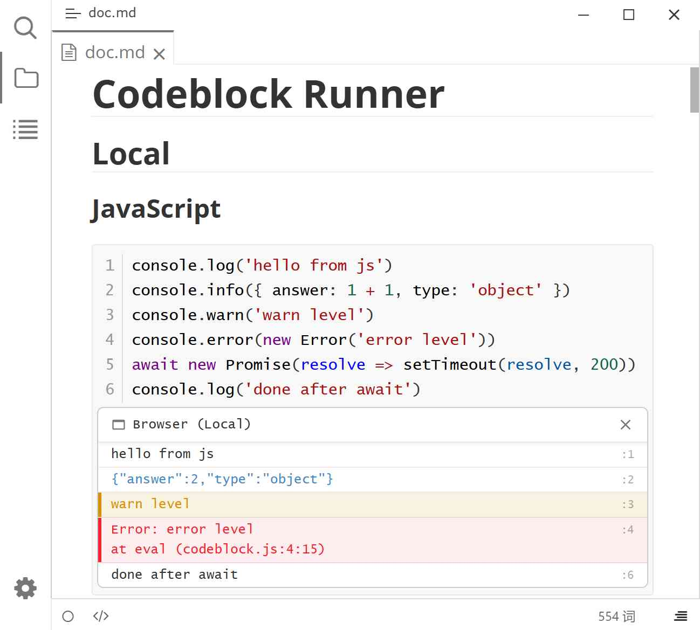

# Typora Plugin Codeblock Runner

[English](./README.md) | 中文

这是一个基于 [typora-community-plugin][core] 的 [Typora](https://typoraio.cn) 插件。受到 [Obsidian Code Runner](https://github.com/chujiu-dev/obsidian-code-runner) 启发。

在笔记中直接运行 `js` / `node` / `ts` / `html` / `rust` / `kotlin` / `haskell` / `crystal` / `v` / `go` / `java` 代码块：鼠标悬浮到代码块上点击 ▶，输出便以内联方式显示在代码下方，并保留 ANSI 颜色。输出按代码内容缓存。

## 预览

## 使用

| 操作 | 方式 |
| --- | --- |
| 运行代码块 | 悬浮到代码块上点击 ▶ |
| 取消运行状态 | 运行中点击 ⏹（见「已知限制」） |
| 清除单个块的输出 | 点击输出区头部清空按钮 |
| 运行光标所在代码块 | `Alt+Ctrl+R`，或 <kbd>F1</kbd> → "运行光标所在代码块" |
| 清除所有代码块输出 | <kbd>F1</kbd> → "清除所有代码块输出" |

## 支持的语言

| 语言 | 别名 | 运行时 | OS | 说明 |
| --- | --- | --- | --- | --- |
| JavaScript | `js`、`javascript` | Browser (Local) / OneCompiler (Remote) | 全平台（本地）/ Windows / Linux（OneCompiler） | 运行方式在设置中选择：**Browser (Local)** 在异步函数上下文中执行（`await` 可用）；**OneCompiler (Remote)** 发送到 [OneCompiler](https://onecompiler.com/javascript)。 |
| TypeScript | `ts`、`typescript` | Browser (Local) / OneCompiler (Remote) | 全平台（本地）/ Windows / Linux（OneCompiler） | 运行方式在设置中选择：**Browser (Local)** 由 Sucrase 转译后作为 JavaScript 执行；**OneCompiler (Remote)** 发送到 [OneCompiler](https://onecompiler.com/typescript)。 |
| Node.js | `node`、`nodejs` | Node.js VM (Local) / OneCompiler (Remote) | Windows / Linux | 运行方式在设置中选择：**Node.js VM (Local)** 用 Node 的 `vm` 编译执行；**OneCompiler (Remote)** 发送到 [OneCompiler](https://onecompiler.com/nodejs)。远程方式需要联网。 |
| HTML | `html` | Browser (Local) | 全平台 | 运行方式在设置中选择：**Browser (Local)** 渲染在 closed Shadow DOM 中（内联 `<script>` 不会执行），**iframe (Local)** 渲染在 sandboxed iframe 中，脚本会执行。 |
| Crystal | `crystal`、`cr` | Crystal Playground (Remote) | 全平台 | 发送到 [Crystal Playground](https://play.crystal-lang.org)，需要联网。 |
| Go | `go`、`golang` | Go Playground (Remote) | Windows / Linux | 发送到 [Go Playground](https://go.dev/play)，需要联网。 |
| Haskell | `hs`、`haskell` | Haskell Playground (Remote) | 全平台 | 发送到 [Haskell Playground](https://play.haskell.org)，需要联网。 |
| Java | `java` | Java Playground (Remote) | Windows / Linux | 发送到 [Java Playground](https://dev.java/playground)。支持顶层语句、import 与类定义（Java 27 + 预览特性）。需要联网。 |
| Kotlin | `kotlin`、`kt` | Kotlin Playground (Remote) | Windows / Linux | 发送到 [Kotlin Playground](https://play.kotlinlang.org)，需要联网。 |
| Rust | `rust`、`rs` | Rust Playground (Remote) | 全平台 | 发送到 [Rust Playground](https://play.rust-lang.org)，需要联网。 |
| V | `v`、`vlang` | V Playground (Remote) | Windows / Linux | 发送到 [V Playground](https://play.vlang.io)，需要联网。 |
| Bash | `bash`、`sh` | OneCompiler (Remote) | Windows / Linux | 发送到 [OneCompiler](https://onecompiler.com/bash)，需要联网。 |
| C | `c` | OneCompiler (Remote) | Windows / Linux | 发送到 [OneCompiler](https://onecompiler.com/c)，需要联网。 |
| C++ | `cpp`、`cc` | OneCompiler (Remote) | Windows / Linux | 发送到 [OneCompiler](https://onecompiler.com/cpp)，需要联网。 |
| C# | `csharp`、`cs` | OneCompiler (Remote) | Windows / Linux | 发送到 [OneCompiler](https://onecompiler.com/csharp)，需要联网。 |
| Dart | `dart` | OneCompiler (Remote) | Windows / Linux | 发送到 [OneCompiler](https://onecompiler.com/dart)，需要联网。 |
| Julia | `julia`、`jl` | OneCompiler (Remote) | Windows / Linux | 发送到 [OneCompiler](https://onecompiler.com/julia)，需要联网。 |
| Lua | `lua` | OneCompiler (Remote) | Windows / Linux | 发送到 [OneCompiler](https://onecompiler.com/lua)，需要联网。 |
| PHP | `php` | OneCompiler (Remote) | Windows / Linux | 发送到 [OneCompiler](https://onecompiler.com/php)，需要联网。 |
| PowerShell | `powershell`、`ps1`、`pwsh` | OneCompiler (Remote) | Windows / Linux | 发送到 [OneCompiler](https://onecompiler.com/powershell)，需要联网。 |
| Python | `python`、`py` | OneCompiler (Remote) | Windows / Linux | 发送到 [OneCompiler](https://onecompiler.com/python)，需要联网。 |
| Python 2 | `python2`、`py2` | OneCompiler (Remote) | Windows / Linux | 发送到 [OneCompiler](https://onecompiler.com/python2)，需要联网。 |
| R | `r` | OneCompiler (Remote) | Windows / Linux | 发送到 [OneCompiler](https://onecompiler.com/r)，需要联网。 |
| Swift | `swift` | OneCompiler (Remote) | Windows / Linux | 发送到 [OneCompiler](https://onecompiler.com/swift)，需要联网。 |
| Zig | `zig` | OneCompiler (Remote) | Windows / Linux | 发送到 [OneCompiler](https://onecompiler.com/zig)，需要联网。 |

## 设置

打开「设置 → 插件 → Codeblock Runner」。

| 设置项 | 取值 | 默认值 | 说明 |
| --- | --- | --- | --- |
| 运行语言 | 开 / 关（按语言） | 本地：开，远程：关 | 逐项开关每种语言。远程语言（`rust`、`kotlin`、`haskell`、`crystal`、`v`、`go`、`java`、`bash`、`c`、`cpp`、`csharp`、`python`、`powershell`、`php`、`lua`、`python2`、`r`、`swift`、`dart`、`julia`、`zig`）会将代码发送到在线 playground，默认关闭，需手动开启。运行已禁用的语言会在输出区提示。 |
| HTML 运行方式 | Browser (Local) / iframe (Local) | Browser (Local) | HTML 行上的下拉选项。**Browser (Local)** 渲染在 closed Shadow DOM 中（内联 `<script>` 不会执行）；**iframe (Local)** 渲染在 sandboxed iframe 中，脚本会执行，但与笔记隔离（opaque origin，无法同源访问）。 |
| JavaScript 运行方式 | Browser (Local) / OneCompiler (Remote) | Browser (Local) | JavaScript 行上的下拉选项。**Browser (Local)** 在渲染进程中执行；**OneCompiler (Remote)** 发送到 [OneCompiler](https://onecompiler.com/javascript)。 |
| TypeScript 运行方式 | Browser (Local) / OneCompiler (Remote) | Browser (Local) | TypeScript 行上的下拉选项。**Browser (Local)** 由 Sucrase 转译后在渲染进程中执行；**OneCompiler (Remote)** 发送到 [OneCompiler](https://onecompiler.com/typescript)。 |
| Node.js 运行方式 | Node.js VM (Local) / OneCompiler (Remote) | Node.js VM (Local) | Node.js 行上的下拉选项。**Node.js VM (Local)** 在进程内通过 Node 的 `vm` 执行；**OneCompiler (Remote)** 发送到 [OneCompiler](https://onecompiler.com/nodejs)。 |

## 安装

1. 先安装 [typora-community-plugin][core]
2. 打开「设置 → 插件市场」，搜索 "Codeblock Runner" 并安装。

## 已知限制

- `js` / `ts` 代码块中，BOM/DOM/网络与 Typora 相关全局（`window`、`document`、`fetch`、`reqnode`、`editor` 等）被屏蔽为 `undefined`。这是防误触护栏，并非安全沙箱：构造函数链、间接 `eval`、动态 `import()` 仍可拿到真实全局，且严格模式下无法屏蔽 `eval`。
- `js` / `ts` / `node` 代码块有 5 秒超时：带花括号的循环体会在超时后抛出 `Loop Timeout`，挂起的 `await` 由外层整体超时兜底。无花括号的单语句循环体不会注入检查，这类死循环仍可能卡住 Typora。
- TypeScript 转译不做类型检查，类型错误不会中断执行。
- `node` 代码块中的 Node.js 内置模块名可用，但相对路径不会按笔记所在目录解析。
- `node` 代码块仅在 Windows 与 Linux 上运行。Typora 不会在 macOS 上暴露 Node（`reqnode`），因此该平台上会直接报错。
- `html` 代码块中的内联 `<script>` 在 **Browser (Local)** 运行方式下不执行（closed Shadow DOM）；将 HTML 运行方式切换为 **iframe (Local)** 后脚本会执行。
- `rust` / `kotlin` / `hs` / `crystal` / `v` / `go` / `java` 代码块运行在对应的在线 playground 上，需要联网，离线不可用。Windows / Linux 上请求经由 Node 发出（无 CORS 问题）；macOS 上回退到 `fetch`，若 playground 不允许跨域请求则可能被拒绝。
- 在 macOS 上，`kotlin` / `v` / `go` / `java` 的设置项会被隐藏且无法启用：这些 playground 不返回 CORS 头，渲染进程的 `fetch` 回退会被拒绝。
- ⏹ 只能取消 UI 的运行状态，无法中断已在执行的代码。
- 「清除所有代码块输出」会同时清除**每个**代码块的输出缓存，包括当前未打开的笔记。

[core]: https://github.com/typora-community-plugin/typora-community-plugin
